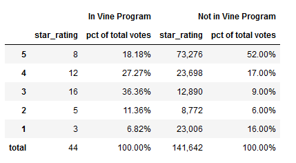

# Amazon_Vine_Analysis

## Resources
Jupyter Notebook 6.3.0 Pandas 1.2.4 AWS RDS, S3

## Overview

Amazon Vine is a service provided by Amazon in which product manufacturers receive reviews from trusted reviewers in exchange for free products.  The purpose of this analysis is to determine whether or not any bias is present in Amazon Vine reviews.

## Results

[Fig1: Star Rating Summary](other_resources/01_star_rating_summary_.png?raw=true "Figure 1: Star Rating Summary")

Figure 1 displays the summarized results of the analysis.

- There were 141,642 non-Vine reviews, and 44 Vine reviews.
- There were 73,276 non-Vine 5 star ratings, and 8 Vine 5 star ratings.
- 52% of Non-Vine results were 5 star, while 18% of Vine results were 5 star.

## Summary

Based on the DVDs data set, there appears to be no positivity bias in the Vine program.  As a percent of total members of the respective classes, less 5 star reviews are awarded in the Vine program than are awarded to Non-Vine products.  That said, ideally all of the datasets would be run in a similar fashon, and the Non-Vine 5 -Star percentages would be plotted in a scatter plot against the Vine program 5-star percentages.  With this data plot, a correlation analysis should be run, to establish statistical parameters around the results.